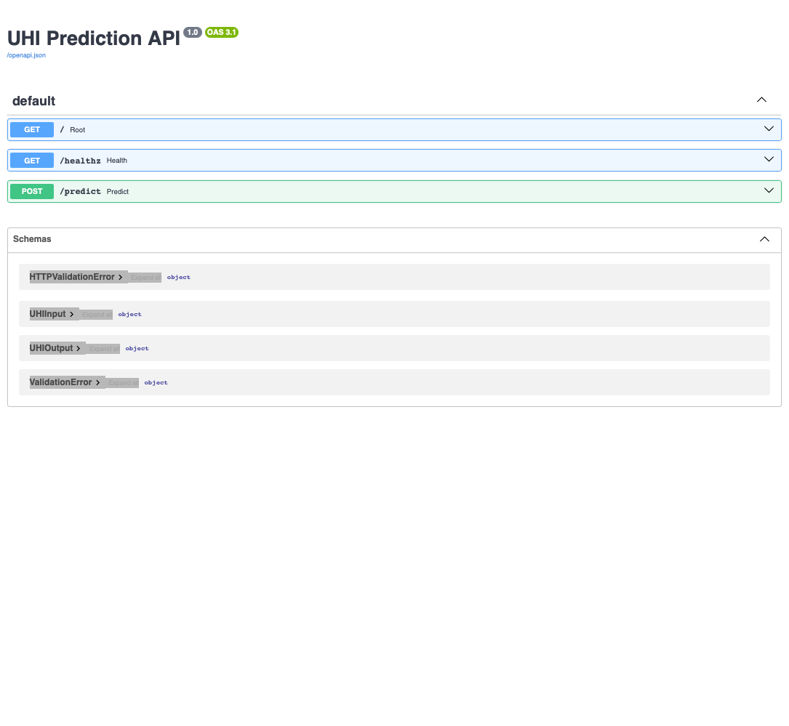
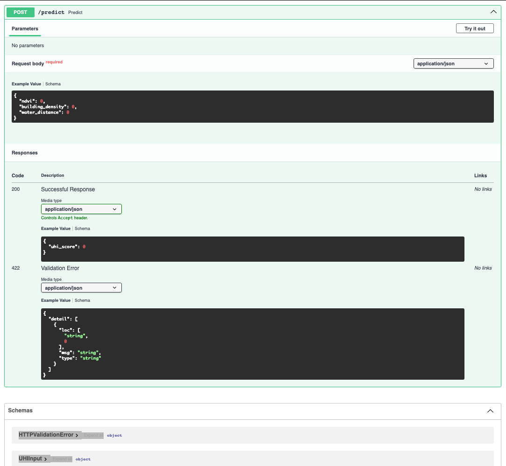
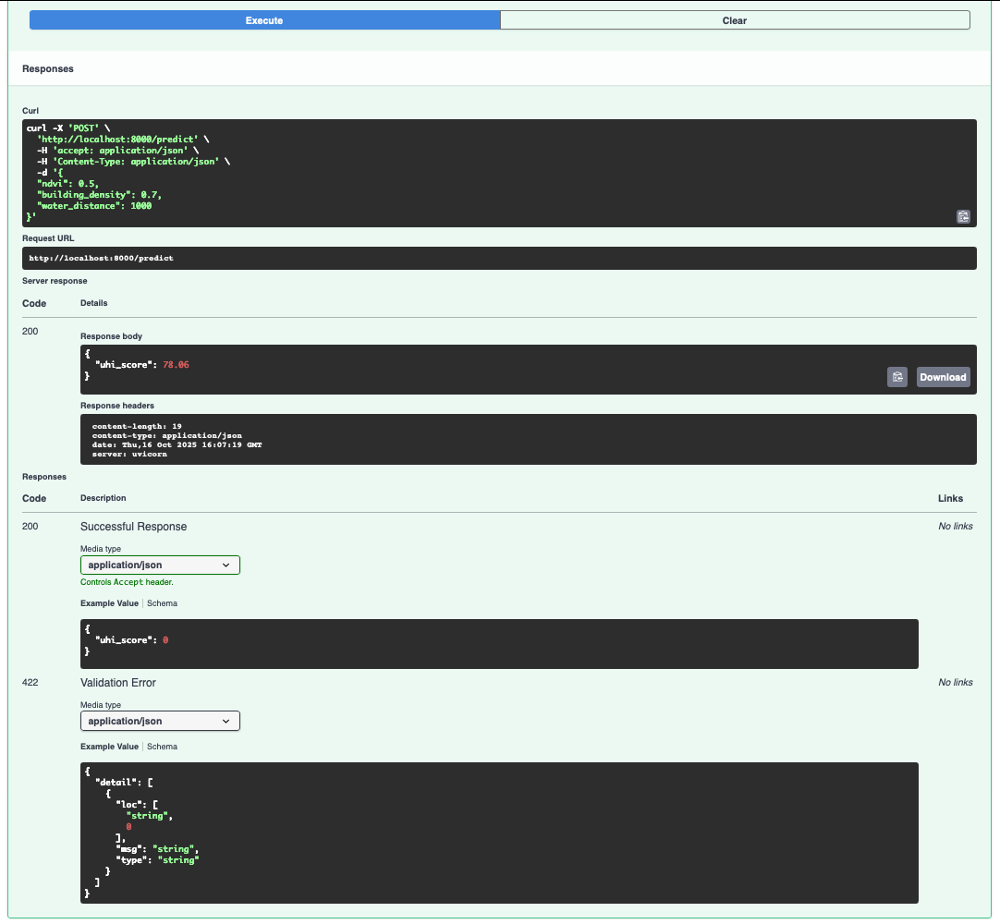

# MLOps Environnement/GIS/geoIA — Mac M1

Parcours débutant → freelance MLOps (16 semaines).

## Démarrage rapide

```bash
# Activer l'environnement
conda activate mlops

# Vérifier le setup
make check-env
```

## Services disponibles

### 🌡️ UHI Service (Îlots de chaleur urbains)

Prédiction du score UHI (0-100) basée sur NDVI, densité bâtie, distance à l'eau.

**Démarrage** :
```bash
make train SERVICE=uhi_service  # Entraîner le modèle
make serve SERVICE=uhi_service  # Lancer l'API (port 8000)
make smoke SERVICE=uhi_service  # Test fumigène
```

**Exemple d'appel** :
```bash
curl -X POST http://localhost:8000/predict \
  -H "Content-Type: application/json" \
  -d '{"ndvi": 0.5, "building_density": 0.7, "water_distance": 1000}'
```

**Réponse** :
```json
{"uhi_score": 78.06}
```

## 📸 Captures d'écran

### API Documentation (FastAPI auto-docs)



### Endpoint /predict (schéma Pydantic)



### Response validation (réponse en direct)



## Statut

- [x] Environnement conda configuré
- [x] **S1 — Mini-labo "Hello MLOps"** ✅
- [x] S2 — Git/GitHub
- [ ] S3 — Tests fumigènes (pytest)
- [ ] S4 — MLflow Tracking

Voir `PLAN_MAITRE.md` pour la roadmap complète.

## Métriques modèle (v1)

- MAE : ~8.5 (sur données synthétiques)
- R² : ~0.85
- Latence : <50ms/requête

---

**Portfolio** : https://github.com/lpenric/mlops-env-utile.git
